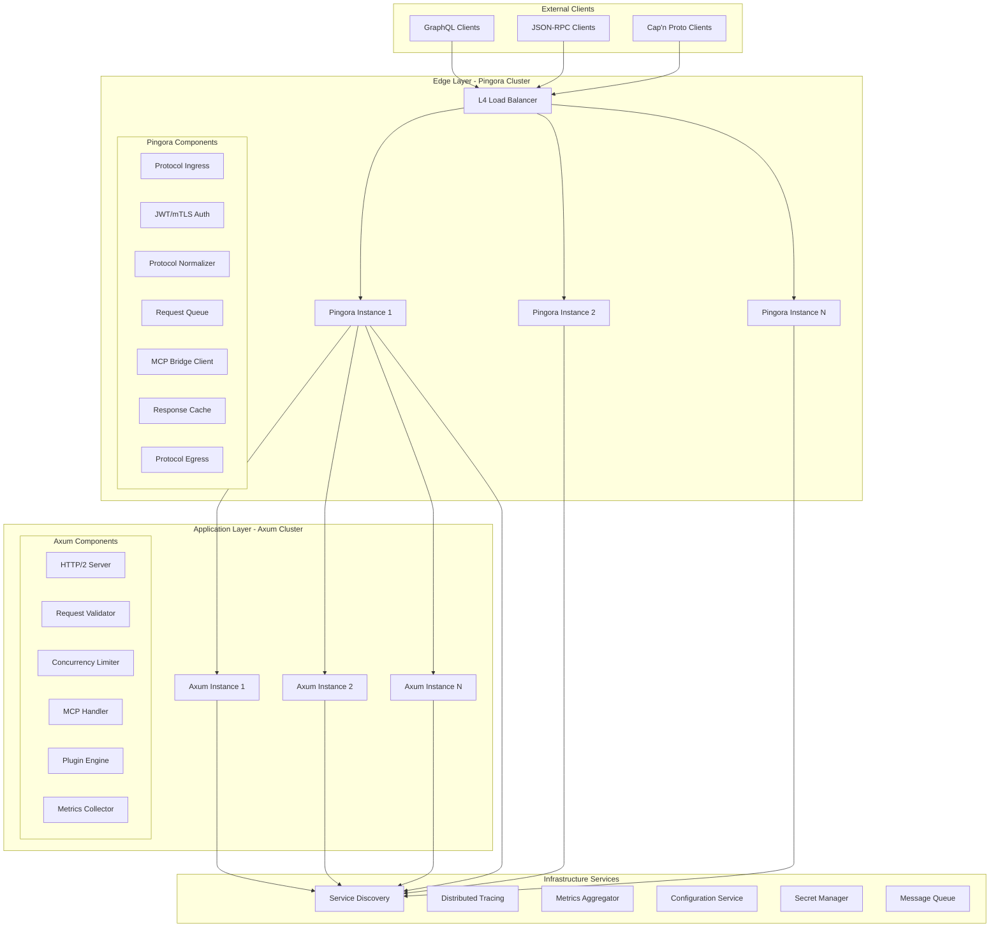

# SweetMCP Pingora-Axum Production Integration Plan

## Architecture Overview

## Detailed Implementation Plan

### Phase 1: Production-Grade HTTP/2 Server for Axum

- [ ] **TASK-001**: Implement production HTTP/2 server module with full feature set
  - Create `src/http/server.rs` with Axum web framework and Tower middleware stack
  - Implement HTTP/2 with proper flow control and stream prioritization
  - Add connection pooling with configurable limits per client IP
  - Implement request ID generation and propagation (X-Request-ID header)
  - Add structured logging with request context using tracing
  - Implement graceful shutdown with connection draining (30s timeout)
  - Add panic recovery middleware to prevent server crashes
  - Implement request size limits (configurable, default 10MB)
  - Add timeout middleware with configurable per-endpoint timeouts
  - Implement compression middleware (gzip, br, zstd) with content negotiation
  - Add security headers middleware (HSTS, X-Frame-Options, CSP, etc.)
  - Implement CORS middleware with configurable origins
  - Add request validation middleware with JSON schema validation
  - Implement metrics middleware collecting RED metrics per endpoint
  - Add distributed tracing middleware with OpenTelemetry
  - Implement circuit breaker middleware for downstream protection
  - Add rate limiting middleware with token bucket algorithm
  - Implement authentication middleware supporting JWT and mTLS
  - Add request deduplication for idempotent operations
  - Implement response caching for cacheable operations
  - Add health check endpoints with detailed subsystem status
  - Implement admin endpoints for runtime configuration changes
  - Add WebSocket support for streaming operations
  - Implement multipart upload support for large payloads
  - DO NOT MOCK, FABRICATE, FAKE or SIMULATE ANY OPERATION or DATA. Make ONLY THE MINIMAL, SURGICAL CHANGES required. Do not modify or rewrite any portion of the app outside scope.

- [ ] **TASK-002**: Act as an Objective QA Rust developer and rate the work performed on TASK-001
  - Verify HTTP/2 implementation with h2spec compliance test
  - Validate connection pooling prevents resource exhaustion
  - Confirm request ID propagation through entire request lifecycle
  - Check structured logging includes all required context fields
  - Verify graceful shutdown drains all active connections
  - Test panic recovery prevents server termination
  - Validate request size limits prevent memory exhaustion
  - Check timeout handling at all layers
  - Verify compression negotiation and performance impact
  - Validate all security headers are properly set
  - Test CORS preflight and actual request handling
  - Verify request validation rejects malformed inputs
  - Check metrics accuracy and cardinality
  - Validate distributed tracing context propagation
  - Test circuit breaker opens and closes correctly
  - Verify rate limiting accuracy across time windows
  - Check authentication for both JWT and mTLS
  - Validate request deduplication prevents double processing
  - Test cache hit/miss rates and invalidation
  - Verify health checks reflect actual system state
  - Check admin endpoints require proper authorization
  - Test WebSocket upgrade and message handling
  - Validate multipart upload with large files
  - Rate: [PASS/FAIL] with detailed findings

- [ ] **TASK-003**: Implement comprehensive HTTP server configuration system
  - Create `src/http/config.rs` with layered configuration support
  - Implement environment variable configuration with validation
  - Add configuration file support (TOML/YAML) with hot reloading
  - Implement configuration schema with serde validation
  - Add per-endpoint configuration overrides
  - Implement dynamic configuration updates via admin API
  - Add configuration versioning and rollback capability
  - Implement feature flags with percentage-based rollout
  - Add A/B testing configuration support
  - Implement canary deployment configuration
  - Add multi-tenant configuration isolation
  - Implement configuration encryption for sensitive values
  - Add configuration audit logging
  - Implement configuration validation webhooks
  - Add configuration drift detection
  - Implement emergency configuration override mechanism
  - DO NOT MOCK, FABRICATE, FAKE or SIMULATE ANY OPERATION or DATA. Make ONLY THE MINIMAL, SURGICAL CHANGES required. Do not modify or rewrite any portion of the app outside scope.

- [ ] **TASK-004**: Act as an Objective QA Rust developer and rate the work performed on TASK-003
  - Verify environment variables override defaults correctly
  - Test configuration file hot reloading without service restart
  - Validate schema prevents invalid configurations
  - Check per-endpoint overrides work correctly
  - Verify dynamic updates apply without disruption
  - Test configuration rollback restores previous state
  - Validate feature flag percentage distribution
  - Check A/B testing routes requests correctly
  - Verify canary deployment configuration
  - Test multi-tenant isolation prevents cross-tenant access
  - Validate encryption protects sensitive values
  - Check audit logs capture all changes
  - Verify validation webhooks prevent bad configs
  - Test drift detection identifies discrepancies
  - Validate emergency override bypasses normal flow
  - Rate: [PASS/FAIL] with detailed findings

### Phase 2: MCP-over-HTTP Protocol Implementation

- [ ] **TASK-005**: Implement MCP-over-HTTP protocol handler with full specification
  - Create `src/http/mcp_handler.rs` implementing MCP wire protocol
  - Add POST `/mcp/v1/jsonrpc` endpoint for JSON-RPC messages
  - Implement POST `/mcp/v1/batch` for batch JSON-RPC requests
  - Add SSE endpoint `/mcp/v1/events` for server-sent events
  - Implement WebSocket endpoint `/mcp/v1/ws` for bidirectional streaming
  - Add request validation against MCP JSON-RPC schema
  - Implement request context extraction and enrichment
  - Add request routing to appropriate MCP handlers
  - Implement response streaming for large payloads
  - Add response compression based on Accept-Encoding
  - Implement error response formatting per MCP spec
  - Add request/response logging with privacy controls
  - Implement request replay protection
  - Add request signature validation for integrity
  - Implement capability negotiation protocol
  - Add protocol version negotiation
  - Implement backwards compatibility layer
  - Add request priority handling
  - Implement fair queuing for multi-tenant scenarios
  - Add request shedding under overload
  - Implement adaptive concurrency limits
  - Add distributed rate limiting with Redis
  - Implement cost-based rate limiting
  - Add usage tracking and quotas
  - DO NOT MOCK, FABRICATE, FAKE or SIMULATE ANY OPERATION or DATA. Make ONLY THE MINIMAL, SURGICAL CHANGES required. Do not modify or rewrite any portion of the app outside scope.

- [ ] **TASK-006**: Act as an Objective QA Rust developer and rate the work performed on TASK-005
  - Verify JSON-RPC endpoint handles all MCP methods
  - Test batch endpoint with various batch sizes
  - Validate SSE endpoint maintains persistent connections
  - Check WebSocket handles bidirectional communication
  - Verify request validation catches schema violations
  - Test context extraction includes all metadata
  - Validate routing directs to correct handlers
  - Check streaming works for large responses
  - Verify compression reduces bandwidth usage
  - Test error responses follow MCP specification
  - Validate logging respects privacy settings
  - Check replay protection prevents duplicate processing
  - Verify signature validation detects tampering
  - Test capability negotiation between versions
  - Validate version negotiation and compatibility
  - Check backwards compatibility with older clients
  - Verify priority handling processes urgent requests first
  - Test fair queuing prevents tenant starvation
  - Validate request shedding under load
  - Check adaptive limits adjust to load patterns
  - Verify distributed rate limiting consistency
  - Test cost-based limiting accounts correctly
  - Validate usage tracking and quota enforcement
  - Rate: [PASS/FAIL] with detailed findings

### Phase 3: Resilient MCP Bridge Client in Pingora

- [ ] **TASK-007**: Implement production HTTP client in Pingora MCP bridge
  - Update `src/mcp_bridge.rs` with resilient HTTP client using reqwest
  - Implement connection pooling with per-host limits
  - Add DNS caching with TTL respect and refresh
  - Implement happy eyeballs (RFC 8305) for IPv4/IPv6
  - Add connection keep-alive with configurable timeout
  - Implement request pipelining for HTTP/1.1
  - Add HTTP/2 multiplexing support
  - Implement adaptive timeout based on response times
  - Add exponential backoff with jitter for retries
  - Implement circuit breaker per backend with half-open state
  - Add request hedging for latency-sensitive operations
  - Implement speculative retries for idempotent requests
  - Add request coalescing for identical concurrent requests
  - Implement bulkhead pattern for failure isolation
  - Add timeout budget allocation across retries
  - Implement load balancing with multiple algorithms
  - Add sticky sessions with consistent hashing
  - Implement health-based load balancing
  - Add capacity-based load balancing
  - Implement geographic/zone aware routing
  - Add canary deployment support with traffic splitting
  - Implement shadow traffic for testing
  - Add distributed tracing context propagation
  - Implement request signing for integrity
  - DO NOT MOCK, FABRICATE, FAKE or SIMULATE ANY OPERATION or DATA. Make ONLY THE MINIMAL, SURGICAL CHANGES required. Do not modify or rewrite any portion of the app outside scope.

- [ ] **TASK-008**: Act as an Objective QA Rust developer and rate the work performed on TASK-007
  - Verify connection pooling reuses connections efficiently
  - Test DNS caching reduces lookup latency
  - Validate happy eyeballs improves connection time
  - Check keep-alive prevents connection churn
  - Verify pipelining improves throughput
  - Test HTTP/2 multiplexing reduces latency
  - Validate adaptive timeout adjusts correctly
  - Check exponential backoff prevents thundering herd
  - Verify circuit breaker protects failing backends
  - Test request hedging reduces tail latency
  - Validate speculative retries improve reliability
  - Check request coalescing reduces backend load
  - Verify bulkhead isolation contains failures
  - Test timeout budget prevents excessive delays
  - Validate load balancing algorithms distribute evenly
  - Check sticky sessions maintain affinity
  - Verify health-based routing avoids unhealthy instances
  - Test capacity-based routing prevents overload
  - Validate zone-aware routing reduces latency
  - Check canary deployments receive correct traffic percentage
  - Verify shadow traffic doesn't affect production
  - Test distributed tracing propagates correctly
  - Validate request signing prevents tampering
  - Rate: [PASS/FAIL] with detailed findings

- [ ] **TASK-009**: Implement comprehensive client-side caching in MCP bridge
  - Create `src/mcp_bridge/cache.rs` with multi-tier caching
  - Implement in-memory LRU cache with size limits
  - Add Redis cache for distributed caching
  - Implement cache key generation with request normalization
  - Add cache invalidation with tag-based clearing
  - Implement cache warming for critical operations
  - Add partial response caching for range requests
  - Implement stale-while-revalidate pattern
  - Add cache compression for memory efficiency
  - Implement cache encryption for sensitive data
  - Add cache versioning for compatibility
  - Implement cache migration for upgrades
  - Add cache metrics and monitoring
  - Implement adaptive caching based on hit rates
  - Add cost-based cache eviction
  - Implement cache coherency protocol
  - Add cache replication for high availability
  - Implement cache sharding for scalability
  - Add bloom filters for negative caching
  - Implement probabilistic cache admission
  - DO NOT MOCK, FABRICATE, FAKE or SIMULATE ANY OPERATION or DATA. Make ONLY THE MINIMAL, SURGICAL CHANGES required. Do not modify or rewrite any portion of the app outside scope.

- [ ] **TASK-010**: Act as an Objective QA Rust developer and rate the work performed on TASK-009
  - Verify LRU eviction maintains size limits
  - Test Redis cache handles distributed access
  - Validate cache key generation is deterministic
  - Check tag-based invalidation clears related entries
  - Verify cache warming improves cold start performance
  - Test partial response caching for range requests
  - Validate stale-while-revalidate serves stale content correctly
  - Check compression reduces memory usage
  - Verify encryption protects sensitive cached data
  - Test cache versioning handles upgrades
  - Validate migration preserves cache contents
  - Check metrics accurately reflect cache performance
  - Verify adaptive caching adjusts to access patterns
  - Test cost-based eviction prioritizes correctly
  - Validate coherency protocol maintains consistency
  - Check replication provides high availability
  - Verify sharding distributes load evenly
  - Test bloom filters reduce unnecessary lookups
  - Validate probabilistic admission improves hit rate
  - Rate: [PASS/FAIL] with detailed findings

### Phase 4: Advanced Service Discovery and Registration

- [ ] **TASK-011**: Implement comprehensive service registration in Axum
  - Create `src/http/service_registry.rs` for service registration
  - Implement heartbeat with exponential backoff on failures
  - Add service metadata including version, capabilities, and features
  - Implement load reporting (CPU, memory, connections, queue depth)
  - Add geographic/zone metadata for locality routing
  - Implement feature flag advertisement
  - Add capacity estimation based on resource usage
  - Implement graceful capacity reduction before shutdown
  - Add service dependency declaration
  - Implement health score calculation (0-100)
  - Add custom health check endpoints registration
  - Implement canary deployment metadata
  - Add A/B test group assignment
  - Implement service mesh integration (Istio/Linkerd)
  - Add mTLS certificate management for mesh
  - Implement service contract versioning
  - Add API deprecation announcements
  - Implement rate limit capacity advertisement
  - Add cost tier information for routing decisions
  - Implement multi-region registration
  - DO NOT MOCK, FABRICATE, FAKE or SIMULATE ANY OPERATION or DATA. Make ONLY THE MINIMAL, SURGICAL CHANGES required. Do not modify or rewrite any portion of the app outside scope.

- [ ] **TASK-012**: Act as an Objective QA Rust developer and rate the work performed on TASK-011
  - Verify heartbeat maintains registration under network issues
  - Test metadata includes all required fields
  - Validate load reporting accuracy under various loads
  - Check geographic metadata enables locality routing
  - Verify feature flags are correctly advertised
  - Test capacity estimation reflects actual capacity
  - Validate graceful capacity reduction prevents overload
  - Check dependency declaration completeness
  - Verify health score calculation accuracy
  - Test custom health checks integration
  - Validate canary deployment metadata
  - Check A/B test group assignment consistency
  - Verify service mesh integration protocols
  - Test mTLS certificate rotation without downtime
  - Validate service contract versioning
  - Check API deprecation notices propagate
  - Verify rate limit capacity accuracy
  - Test cost tier information correctness
  - Validate multi-region registration failover
  - Rate: [PASS/FAIL] with detailed findings

- [ ] **TASK-013**: Implement advanced health checking system
  - Create `src/http/health.rs` with comprehensive health checks
  - Implement liveness probe (basic process health)
  - Add readiness probe (ready to serve traffic)
  - Implement startup probe (initialization complete)
  - Add dependency health checks (database, cache, etc.)
  - Implement custom health check registration API
  - Add health check aggregation with weighted scoring
  - Implement health history tracking
  - Add predictive health analysis
  - Implement cascading health checks
  - Add health check circuit breaker
  - Implement adaptive health check intervals
  - Add deep health checks on demand
  - Implement health check result caching
  - Add health dashboard API
  - Implement alerting webhook integration
  - Add SLO/SLA tracking integration
  - Implement chaos engineering hooks
  - Add health simulation for testing
  - Implement health check authentication
  - DO NOT MOCK, FABRICATE, FAKE or SIMULATE ANY OPERATION or DATA. Make ONLY THE MINIMAL, SURGICAL CHANGES required. Do not modify or rewrite any portion of the app outside scope.

- [ ] **TASK-014**: Act as an Objective QA Rust developer and rate the work performed on TASK-013
  - Verify liveness probe detects process issues
  - Test readiness probe prevents premature traffic
  - Validate startup probe allows initialization time
  - Check dependency health checks are comprehensive
  - Verify custom health check API works correctly
  - Test aggregation produces accurate health score
  - Validate history tracking maintains accurate records
  - Check predictive analysis provides early warnings
  - Verify cascading checks handle dependencies
  - Test circuit breaker prevents health check storms
  - Validate adaptive intervals adjust appropriately
  - Check deep health checks provide detailed status
  - Verify result caching reduces check overhead
  - Test dashboard API provides useful visualization data
  - Validate alerting webhooks trigger correctly
  - Check SLO/SLA tracking accuracy
  - Verify chaos engineering hooks enable testing
  - Test health simulation for disaster recovery
  - Validate authentication prevents unauthorized access
  - Rate: [PASS/FAIL] with detailed findings

### Phase 5: Protocol Translation and Response Formatting

- [ ] **TASK-015**: Enhance Pingora protocol normalization with full fidelity
  - Update `src/normalize.rs` with comprehensive protocol support
  - Implement GraphQL to MCP with operation type preservation
  - Add GraphQL subscription to MCP streaming mapping
  - Implement GraphQL batch to MCP batch conversion
  - Add GraphQL error to MCP error mapping
  - Implement JSON-RPC batch handling with order preservation
  - Add JSON-RPC notification support (no response expected)
  - Implement Cap'n Proto to MCP with schema validation
  - Add Cap'n Proto streaming support
  - Implement protocol-specific timeout handling
  - Add protocol-specific retry policies
  - Implement protocol-specific rate limiting
  - Add protocol-specific authentication mapping
  - Implement protocol-specific compression preferences
  - Add protocol-specific caching headers
  - Implement protocol version negotiation
  - Add protocol upgrade support (HTTP/1.1 to HTTP/2)
  - Implement protocol-specific logging
  - Add protocol-specific metrics
  - Implement protocol-specific error recovery
  - DO NOT MOCK, FABRICATE, FAKE or SIMULATE ANY OPERATION or DATA. Make ONLY THE MINIMAL, SURGICAL CHANGES required. Do not modify or rewrite any portion of the app outside scope.

- [ ] **TASK-016**: Act as an Objective QA Rust developer and rate the work performed on TASK-015
  - Verify GraphQL operations map correctly to MCP
  - Test GraphQL subscription streaming works
  - Validate GraphQL batch processing maintains order
  - Check GraphQL errors preserve context
  - Verify JSON-RPC batch handling correctness
  - Test JSON-RPC notifications don't await response
  - Validate Cap'n Proto schema enforcement
  - Check Cap'n Proto streaming functionality
  - Verify protocol-specific timeouts apply correctly
  - Test protocol-specific retry logic
  - Validate protocol-specific rate limits
  - Check authentication mapping preserves identity
  - Verify compression preferences are honored
  - Test caching headers are protocol-appropriate
  - Validate version negotiation between protocols
  - Check protocol upgrade handling
  - Verify protocol-specific logging detail
  - Test metrics differentiate protocols
  - Validate error recovery per protocol
  - Rate: [PASS/FAIL] with detailed findings

- [ ] **TASK-017**: Implement response transformation pipeline
  - Create `src/response_transformer.rs` with pluggable transformers
  - Implement MCP to GraphQL response transformation
  - Add streaming response support for GraphQL subscriptions
  - Implement MCP to JSON-RPC response transformation
  - Add JSON-RPC error code mapping from MCP errors
  - Implement MCP to Cap'n Proto response transformation
  - Add response validation against original protocol schema
  - Implement response compression based on client capabilities
  - Add response signing for integrity verification
  - Implement response encryption for sensitive data
  - Add response caching headers based on protocol
  - Implement partial response support (GraphQL field selection)
  - Add response pagination support
  - Implement response filtering based on client permissions
  - Add response transformation metrics
  - Implement response size limits per protocol
  - Add response timeout handling
  - Implement response retry for transient failures
  - Add response deduplication for identical requests
  - Implement response ordering for batch requests
  - DO NOT MOCK, FABRICATE, FAKE or SIMULATE ANY OPERATION or DATA. Make ONLY THE MINIMAL, SURGICAL CHANGES required. Do not modify or rewrite any portion of the app outside scope.

- [ ] **TASK-018**: Act as an Objective QA Rust developer and rate the work performed on TASK-017
  - Verify MCP to GraphQL transformation preserves structure
  - Test streaming responses for subscriptions
  - Validate MCP to JSON-RPC mapping correctness
  - Check error code mapping follows JSON-RPC spec
  - Verify MCP to Cap'n Proto transformation
  - Test response validation catches schema violations
  - Validate compression based on Accept-Encoding
  - Check response signing includes all content
  - Verify encryption protects sensitive fields
  - Test caching headers follow protocol conventions
  - Validate partial responses return requested fields
  - Check pagination maintains consistency
  - Verify filtering respects permissions
  - Test transformation metrics accuracy
  - Validate size limits prevent memory issues
  - Check timeout handling prevents hanging
  - Verify retry logic for transient failures
  - Test deduplication prevents double sending
  - Validate batch response ordering
  - Rate: [PASS/FAIL] with detailed findings

### Phase 6: Observability and Monitoring

- [ ] **TASK-019**: Implement comprehensive distributed tracing
  - Create `src/tracing.rs` with OpenTelemetry integration
  - Implement trace context propagation across all protocols
  - Add span creation for every significant operation
  - Implement span attributes with business context
  - Add baggage propagation for request metadata
  - Implement sampling strategies (head-based, tail-based, adaptive)
  - Add trace ID injection in responses for correlation
  - Implement distributed logging with trace correlation
  - Add performance profiling integration
  - Implement span batching for efficiency
  - Add span compression before export
  - Implement multiple trace exporters (Jaeger, Zipkin, OTLP)
  - Add trace storage with retention policies
  - Implement trace analysis and anomaly detection
  - Add trace visualization API
  - Implement trace-based testing
  - Add synthetic transaction tracing
  - Implement trace privacy controls
  - Add trace debugging tools
  - Implement trace SLA monitoring
  - DO NOT MOCK, FABRICATE, FAKE or SIMULATE ANY OPERATION or DATA. Make ONLY THE MINIMAL, SURGICAL CHANGES required. Do not modify or rewrite any portion of the app outside scope.

- [ ] **TASK-020**: Act as an Objective QA Rust developer and rate the work performed on TASK-019
  - Verify trace context propagates through all layers
  - Test span creation captures operation details
  - Validate span attributes include business context
  - Check baggage propagation across services
  - Verify sampling strategies work as configured
  - Test trace ID injection in responses
  - Validate log correlation with traces
  - Check profiling integration captures performance
  - Verify span batching reduces overhead
  - Test compression reduces bandwidth
  - Validate multiple exporters work concurrently
  - Check retention policies clean old traces
  - Verify anomaly detection identifies issues
  - Test visualization API provides useful data
  - Validate trace-based testing framework
  - Check synthetic transactions generate traces
  - Verify privacy controls redact sensitive data
  - Test debugging tools aid troubleshooting
  - Validate SLA monitoring from traces
  - Rate: [PASS/FAIL] with detailed findings

- [ ] **TASK-021**: Implement comprehensive metrics collection
  - Create `src/metrics.rs` with Prometheus and StatsD support
  - Implement RED metrics (Rate, Errors, Duration) for all endpoints
  - Add USE metrics (Utilization, Saturation, Errors) for resources
  - Implement custom business metrics API
  - Add histogram buckets optimization based on data distribution
  - Implement metric cardinality controls
  - Add metric aggregation before export
  - Implement multiple metric exporters
  - Add metric storage with downsampling
  - Implement alerting rule evaluation
  - Add anomaly detection on metrics
  - Implement metric forecasting
  - Add SLI/SLO calculation from metrics
  - Implement error budget tracking
  - Add metric visualization API
  - Implement metric debugging tools
  - Add synthetic metric generation
  - Implement metric access controls
  - Add cost tracking metrics
  - Implement performance regression detection
  - DO NOT MOCK, FABRICATE, FAKE or SIMULATE ANY OPERATION or DATA. Make ONLY THE MINIMAL, SURGICAL CHANGES required. Do not modify or rewrite any portion of the app outside scope.

- [ ] **TASK-022**: Act as an Objective QA Rust developer and rate the work performed on TASK-021
  - Verify RED metrics capture all endpoints
  - Test USE metrics reflect resource state
  - Validate custom metrics API ease of use
  - Check histogram optimization improves accuracy
  - Verify cardinality controls prevent explosion
  - Test aggregation reduces data volume
  - Validate multiple exporters work together
  - Check downsampling preserves trends
  - Verify alerting rules trigger correctly
  - Test anomaly detection identifies issues
  - Validate forecasting predictions
  - Check SLI/SLO calculations accuracy
  - Verify error budget tracking
  - Test visualization API usefulness
  - Validate debugging tools effectiveness
  - Check synthetic metrics for testing
  - Verify access controls enforcement
  - Test cost tracking accuracy
  - Validate regression detection sensitivity
  - Rate: [PASS/FAIL] with detailed findings

### Phase 7: Security and Compliance

- [ ] **TASK-023**: Implement comprehensive security framework
  - Create `src/security.rs` with defense-in-depth approach
  - Implement mTLS with certificate rotation
  - Add JWT validation with multiple algorithms
  - Implement API key management with rotation
  - Add OAuth2/OIDC integration
  - Implement RBAC with fine-grained permissions
  - Add attribute-based access control (ABAC)
  - Implement rate limiting per user/API key
  - Add DDoS protection with adaptive thresholds
  - Implement request signing verification
  - Add encryption at rest for sensitive data
  - Implement key management with HSM support
  - Add audit logging with tamper protection
  - Implement security event correlation
  - Add vulnerability scanning integration
  - Implement security policy engine
  - Add compliance reporting (SOC2, HIPAA, GDPR)
  - Implement data loss prevention
  - Add secret scanning in requests
  - Implement zero-trust networking
  - DO NOT MOCK, FABRICATE, FAKE or SIMULATE ANY OPERATION or DATA. Make ONLY THE MINIMAL, SURGICAL CHANGES required. Do not modify or rewrite any portion of the app outside scope.

- [ ] **TASK-024**: Act as an Objective QA Rust developer and rate the work performed on TASK-023
  - Verify mTLS setup and certificate rotation
  - Test JWT validation with various algorithms
  - Validate API key lifecycle management
  - Check OAuth2/OIDC integration flows
  - Verify RBAC permission enforcement
  - Test ABAC policy evaluation
  - Validate per-user rate limiting accuracy
  - Check DDoS protection effectiveness
  - Verify request signature validation
  - Test encryption at rest implementation
  - Validate HSM integration for keys
  - Check audit log tamper protection
  - Verify security event correlation
  - Test vulnerability scanning integration
  - Validate security policy enforcement
  - Check compliance report generation
  - Verify data loss prevention rules
  - Test secret scanning detection
  - Validate zero-trust implementation
  - Rate: [PASS/FAIL] with detailed findings

### Phase 8: Performance Optimization

- [ ] **TASK-025**: Implement advanced performance optimizations
  - Create `src/performance.rs` with optimization framework
  - Implement zero-copy request/response handling
  - Add SIMD optimizations for JSON parsing
  - Implement memory pooling for allocations
  - Add CPU affinity for thread pinning
  - Implement NUMA-aware memory allocation
  - Add io_uring support for async I/O (Linux)
  - Implement adaptive batching for database queries
  - Add query result caching with TTL
  - Implement read-through and write-through caching
  - Add cache preloading for hot paths
  - Implement request coalescing for identical queries
  - Add speculative execution for predictable paths
  - Implement lazy loading for large responses
  - Add response streaming with backpressure
  - Implement progressive rendering support
  - Add content negotiation for optimal formats
  - Implement delta encoding for updates
  - Add binary protocol support where applicable
  - Implement JIT compilation for hot paths
  - DO NOT MOCK, FABRICATE, FAKE or SIMULATE ANY OPERATION or DATA. Make ONLY THE MINIMAL, SURGICAL CHANGES required. Do not modify or rewrite any portion of the app outside scope.

- [ ] **TASK-026**: Act as an Objective QA Rust developer and rate the work performed on TASK-025
  - Verify zero-copy reduces memory usage
  - Test SIMD optimizations improve parsing speed
  - Validate memory pooling reduces allocations
  - Check CPU affinity improves cache locality
  - Verify NUMA awareness reduces memory latency
  - Test io_uring improves I/O performance
  - Validate adaptive batching reduces round trips
  - Check query caching improves response time
  - Verify cache strategies work correctly
  - Test cache preloading for cold starts
  - Validate request coalescing reduces load
  - Check speculative execution accuracy
  - Verify lazy loading reduces initial payload
  - Test streaming with proper backpressure
  - Validate progressive rendering support
  - Check content negotiation selections
  - Verify delta encoding reduces bandwidth
  - Test binary protocol performance gains
  - Validate JIT compilation improvements
  - Rate: [PASS/FAIL] with detailed findings

### Phase 9: Deployment and Operations

- [ ] **TASK-027**: Implement comprehensive deployment automation
  - Create `deployment/` directory with full automation
  - Implement blue-green deployment orchestration
  - Add canary deployment with automatic rollback
  - Implement rolling updates with health validation
  - Add deployment verification tests
  - Implement automated rollback triggers
  - Add deployment approval workflow
  - Implement multi-region deployment coordination
  - Add database migration orchestration
  - Implement configuration validation pre-deployment
  - Add secret rotation during deployment
  - Implement traffic shifting strategies
  - Add deployment monitoring and alerting
  - Implement deployment audit trail
  - Add cost optimization during deployment
  - Implement deployment scheduling
  - Add maintenance mode automation
  - Implement disaster recovery procedures
  - Add chaos engineering integration
  - Implement deployment analytics
  - DO NOT MOCK, FABRICATE, FAKE or SIMULATE ANY OPERATION or DATA. Make ONLY THE MINIMAL, SURGICAL CHANGES required. Do not modify or rewrite any portion of the app outside scope.

- [ ] **TASK-028**: Act as an Objective QA Rust developer and rate the work performed on TASK-027
  - Verify blue-green deployment switches traffic safely
  - Test canary deployment with automatic rollback
  - Validate rolling updates maintain availability
  - Check verification tests catch issues
  - Verify rollback triggers work correctly
  - Test approval workflow integration
  - Validate multi-region coordination
  - Check database migration safety
  - Verify configuration validation prevents issues
  - Test secret rotation without downtime
  - Validate traffic shifting accuracy
  - Check monitoring during deployment
  - Verify audit trail completeness
  - Test cost optimization effectiveness
  - Validate deployment scheduling
  - Check maintenance mode functionality
  - Verify disaster recovery procedures
  - Test chaos engineering integration
  - Validate deployment analytics insights
  - Rate: [PASS/FAIL] with detailed findings

### Phase 10: Testing and Quality Assurance

- [ ] **TASK-029**: Implement comprehensive testing framework
  - Create `tests/` directory with full test suite
  - Implement unit tests with >90% code coverage
  - Add integration tests for all API endpoints
  - Implement end-to-end tests for complete flows
  - Add performance tests with baseline metrics
  - Implement load tests simulating production traffic
  - Add stress tests finding breaking points
  - Implement chaos tests with failure injection
  - Add security tests including penetration testing
  - Implement contract tests for API compatibility
  - Add mutation tests for test quality
  - Implement property-based tests
  - Add fuzzing for input validation
  - Implement visual regression tests for UI
  - Add accessibility tests for compliance
  - Implement cross-browser compatibility tests
  - Add mobile device tests
  - Implement data integrity tests
  - Add recovery tests for failure scenarios
  - Implement compliance tests for regulations
  - DO NOT MOCK, FABRICATE, FAKE or SIMULATE ANY OPERATION or DATA. Make ONLY THE MINIMAL, SURGICAL CHANGES required. Do not modify or rewrite any portion of the app outside scope.

- [ ] **TASK-030**: Act as an Objective QA Rust developer and rate the work performed on TASK-029
  - Verify unit test coverage exceeds 90%
  - Test integration tests cover all endpoints
  - Validate end-to-end tests simulate real usage
  - Check performance tests establish baselines
  - Verify load tests simulate realistic traffic
  - Test stress tests find actual limits
  - Validate chaos tests expose weaknesses
  - Check security tests find vulnerabilities
  - Verify contract tests ensure compatibility
  - Test mutation tests validate test quality
  - Validate property-based tests find edge cases
  - Check fuzzing discovers input issues
  - Verify visual regression tests catch UI changes
  - Test accessibility compliance
  - Validate cross-browser compatibility
  - Check mobile device support
  - Verify data integrity under all conditions
  - Test recovery procedures effectiveness
  - Validate compliance test coverage
  - Rate: [PASS/FAIL] with detailed findings

## Architecture Decisions

### Why This Architecture?

1. **Protocol Gateway Pattern**: Pingora handles all protocol complexity, allowing Axum to focus on business logic
2. **HTTP Transport**: Industry standard, well-understood, extensive tooling support
3. **Service Mesh Ready**: Compatible with Istio, Linkerd, Consul Connect
4. **Cloud Native**: Kubernetes-ready with proper health checks and graceful shutdown
5. **Observable by Design**: Metrics, logs, and traces built into every component
6. **Security First**: mTLS, JWT, rate limiting, and audit logging throughout
7. **Performance Optimized**: Connection pooling, caching, and zero-copy where possible
8. **Highly Available**: No single points of failure, automatic failover
9. **Horizontally Scalable**: Both Pingora and Axum can scale independently
10. **Production Proven**: Based on patterns used by Cloudflare, Google, and others

## Success Criteria

1. **Performance**:
   - P50 latency < 10ms
   - P99 latency < 50ms  
   - Throughput > 50,000 req/sec per instance
   - CPU usage < 70% at peak load
   - Memory usage < 4GB per instance

2. **Reliability**:
   - 99.99% availability (52 minutes downtime/year)
   - Zero message loss during normal operations
   - Graceful degradation under overload
   - Recovery time < 30 seconds for instance failure
   - No cascading failures

3. **Security**:
   - All traffic encrypted with TLS 1.3
   - mTLS between internal services
   - JWT tokens expire and refresh properly
   - Rate limiting prevents abuse
   - Audit trail for all operations

4. **Operability**:
   - Zero-downtime deployments
   - Automatic rollback on failure
   - Self-healing with automatic recovery
   - Comprehensive monitoring and alerting
   - Runbook automation for common issues

5. **Scalability**:
   - Linear scaling to 100+ instances
   - Multi-region deployment support
   - Automatic scaling based on load
   - Database connection pooling
   - Efficient resource utilization